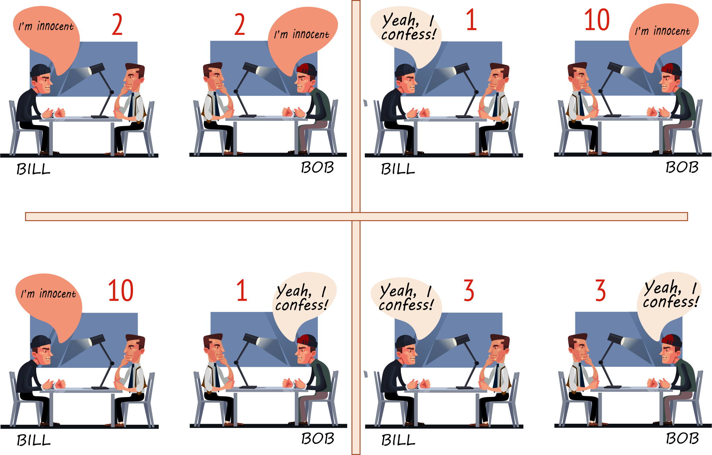

Game Theory
==================

This repository contains my report on **Game Theory** and its
corresponding files for *Summer of Science* conducted by *Maths and Physics Club
IIT Bombay*.

Introduction
------------

**Game Theory** is the science of strategy. It is the study of mathematical models of strategic interaction among rational decision-makers, spreading across scientific disciplines like a spider's intricate web. It attempts to determine mathematically and logically the actions that players should take to secure the best outcomes for themselves in a wide array of games. The games it studies range from chess to child rearing and from tennis to takeovers, from exciting auctions to things of great importance like voting.

**Here, we study the rigorous mathematics behind this topic and explore its application in various fields.**

This report is divided into parts: Theoretical foundations of Non-Cooperative Game Theory followed by Cooperative Game Theory then Mechanism Design. Finally, I encourage you to look at different Games and their exciting results. Check out my Braess’s Paradox Video [here](Braess's%20Paradox.mkv).

**The Report can be viewed** [here](Game%20Theory.pdf).

**My presentation on Braess's Paradox can be viewed here** - [video](Braess%20Paradox.mkv), [slides](Braess%20Paradox.pdf).

TeX-nical Details
-----------------

[This](Game%20Theory.tex)
is the primary TeX file which is to be compiled to get the report.

[This](References.bib)
is the BibTeX file containing the references used by me.